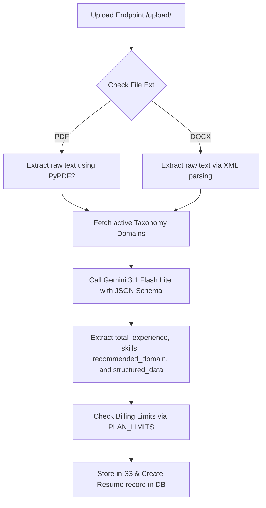

# DataHire: Comprehensive Product & Technical Overview

DataHire is an AI-driven recruitment and job application automation platform that matches candidates to job postings. It reduces manual friction for job seekers (via structured resume parsing, resume optimization, cover letter generation, and automated matching/applying) and helps employers find high-fit candidates through semantic matching, automated pipeline screening, and analytics dashboards.

This document serves as your guide to the codebase, system architecture, core algorithms, and technology stack. Use it to ramp up and prepare for technical cross-questions.

---

## 1. Product Ecosystem: Who Uses What?

DataHire serves three distinct user groups, each with tailored flows:

### A. Job Seekers (Candidates)
*   **Resume Ingestion:** Upload resumes in PDF or DOCX format.
*   **AI Resume Parsing:** Automatically extracts contact details, skills, experience, education, projects, certifications, and languages.
*   **AI Section Optimization:** Tailors specific sections (Skills, Experience, Summary) either generally or targeted toward a specific job description.
*   **AI Cover Letter Generation:** Automatically writes highly relevant cover letters targeted to job postings.
*   **Matching & Recommendation:** Views real-time similarity scores and keyword gap analysis against active jobs.
*   **Auto-Apply Pipeline:** Automates job applications based on role type, location, and salary preferences.

### B. Job Posters (Employers)
*   **Job Posting Management:** Creates and publishes job descriptions, including candidate scoring thresholds.
*   **Candidate Pipelines:** Views and filters candidate profiles mapped by job role.
*   **Shortlist Automation:** Candidates whose AI match scores meet or exceed the employer's set threshold (defaults to 70%) are automatically bucketed into `shortlisted` status.
*   **Company Management:** Updates company branding, logos, and subscription plans.

### C. Administrators
*   **Analytics Dashboards:** Accesses platform growth KPIs (registration counts, domain distributions, active job locations, experience densities).
*   **User Management:** Suspends/revokes users or organizations, manages custom subscription tiers, and adjusts platform-wide defaults.

---

## 2. Technology Stack ("What We Use")

The platform is designed around a modern Python asynchronous ecosystem, leveraging cloud services and advanced AI APIs.

| Component | Technology | Purpose & Usage |
| :--- | :--- | :--- |
| **Backend API** | FastAPI (v0.104.1) | Direct, asynchronous REST API. Serves Swagger (`/api/v1/docs`) and ReDoc (`/api/v1/redoc`) documentation out-of-the-box. |
| **Server** | Uvicorn (v0.24.0) | High-performance ASGI web server. |
| **Database** | PostgreSQL | Primary relational store for user accounts, applications, configurations, and logs. |
| **ORM & Migrations**| SQLAlchemy (v2.0) & Alembic | Handles relational mapping, sessions, and schema changes. |
| **Vector Engine** | `pgvector` | Native PostgreSQL extension utilized to store and compute cosine similarity of high-dimensional embeddings. |
| **AI / LLMs** | Google Gemini API (`gemini-3.1-flash-lite`, `gemini-1.5-flash`) | powers resume parsing, section optimization, cover letter generation, JD keyword extraction, and match insights. |
| **Vector Embeddings** | Google Gemini Embedding API (`models/gemini-embedding-2`) | Generates 384-dimensional vector embeddings for jobs, resumes, and taxonomy elements. |
| **Background Tasks** | Redis & Celery (v5.3.6) | Asynchronous queue broker and task workers for heavy, multi-candidate loops (like daily auto-applies). |
| **File Storage** | AWS S3 via Boto3 | Stores resumes, cover letters, profile images, and company logos. |
| **Payment Gateway** | Stripe (v7.0.0) | Manages subscriptions, invoices, checkout sessions, and portal integration. Supports Card, Apple Pay, Google Pay, and PayPal. |
| **Auth & Security** | Jose (JWT), Passlib (bcrypt) | Secure session tokens, password hashing, and OAuth state verification. |
| **PDF Extraction** | PyPDF2 (v3.0.1) | Extracts raw text from candidate PDF uploads. |
| **PDF Generation** | xhtml2pdf & Jinja2 | Translates HTML templates with inline CSS to printable, downloadable PDF versions of parsed or optimized resumes. |

---

## 3. Architecture & Rationale ("Why We Use It")

### Why FastAPI?
*   **Speed:** FastAPI is one of the fastest Python frameworks available, built on top of Starlette (routing) and Pydantic (validation).
*   **Async Native:** Perfectly suited for I/O-bound operations like calling external APIs (S3, Stripe, Gemini) or database queries, increasing concurrent request limits.
*   **Automatic Docs:** Automatically generates OpenAPI schemas and interactive Swagger UI.

### Why PostgreSQL + pgvector?
*   **Unified Store:** Instead of hosting and maintaining a separate, costly vector database (e.g., Pinecone, Milvus), `pgvector` brings vector distance operations directly into our relational database.
*   **Transactional Integrity (ACID):** We can query structured candidate data (e.g., salary, location preferences) and vector embeddings *in a single SQL query* (using filters and cosine similarity), ensuring strict relational integrity.

### Why Gemini 3.1 Flash Lite?
*   **Cost and Quota Efficiency:** Resume parsing and section optimization require massive prompts (the entire raw text of resumes). Gemini 3.1 Flash Lite offers blazing-fast execution speeds, extremely low token costs, and generous rate limits.
*   **Structured Outputs:** Highly reliable JSON mode ensures that the LLM response maps exactly to the candidate's database schema, preventing parsing crashes.

### Why S3 for File Storage?
*   Storing binary files (like PDFs and images) inside a SQL database degrades query performance and rapidly increases database backup sizes. S3 provides highly reliable, secure, and cost-effective object storage, serving files via temporary or public URLs.

### Why xhtml2pdf with Custom Preprocessing?
*   Generating PDFs from dynamic HTML using tools like Playwright or headless Chrome requires a large memory footprint and long startup times. xhtml2pdf runs natively in Python. 
*   *The Catch:* xhtml2pdf has limited support for modern CSS features (like Tailwind CSS variables, grids, calc, or layers). We resolve this with a custom preprocessing engine (`pdf_service.py`) that flattens layers and strips modern CSS before rendering, keeping container sizing lightweight.

---

## 4. Core Implementation Pipelines ("How We Implement It")

### A. The Ingestion Pipeline (Upload & Parse)
When a candidate uploads a resume file:

> [!NOTE]
> **Docx Parser:** Instead of spinning up heavy docx converters, our `docx` parser directly reads the uploaded bytes, treats it as a zip file, extracts the XML contents of `word/document.xml`, and parses the paragraph tags (`w:p` and `w:t`) for text.

---

### B. The Automatic Embedding & Listener Loop
We maintain vector embeddings for `JobPosting`, `Resume`, `TaxonomyDomain`, `TaxonomyJobRole`, and `TaxonomySkill`. Rather than manually writing code to update embeddings across dozens of endpoints, we use **SQLAlchemy Event Listeners** in [embedding_listener.py](file:///c:/Users/Admin/Desktop/supersourcing/datahire/app/db/embedding_listener.py):
1.  On application startup (`lifespan`), we call `register_embedding_listeners()`.
2.  This registers SQLAlchemy `before_insert` and `before_update` event hooks on the models.
3.  Whenever a model is saved or modified, the listener extracts the text fields (like `job_overview`, `about_role`, or resume sections), concatenates them, and calls `embedding_service.get_embedding(text)`.
4.  The generated 384-dimensional vector is automatically saved to the model's `embedding` or `overall_embedding` column before committing to the DB.
5.  If it is a `JobPosting`, the listener also automatically runs `resume_parser_service.extract_skills_from_jd()` to resolve and update the job's `extracted_skills`.

---

### C. The Matching Engine Core Algorithm
Located in [matching_engine.py](file:///c:/Users/Admin/Desktop/supersourcing/datahire/app/services/matching_engine.py), the scoring algorithm evaluates resumes against job postings using a weighted schema (out of 100 points):

#### 1. Semantic Context & Fit Score (40% Weight)
*   Computes cosine similarity between the Job's `embedding` and the Resume's `overall_embedding`.
*   **Calibration:** The raw cosine similarity score is scaled from the range `[0.70, 0.85]` to `[0.0, 100.0]`. If similarity is below 0.70, it gets 0; if above 0.85, it gets 100.
*   **Domain Multiplier:** If the job's `taxonomy_domain_id` matches the resume's `taxonomy_domain_id`, the score receives a 1.1x boost (up to a max of 100.0).

#### 2. Hard Skills Overlap Score (30% Weight)
*   Compares Job resolved skills with Resume extracted skills using a multi-tiered approach:
    *   **Tier 1:** Direct exact normalized match (lowercase, removing non-alphanumeric characters).
    *   **Tier 2:** Substring and word boundary checks (e.g., matching "sql" inside "ms sql database" or "python" in "python 3" using regex `\b`).
    *   **Tier 3 (Fallback):** If the resume lacks structured skills, it performs a fallback regex search across the full text of the resume's structured experience and summary.
*   *Weight Redistribution:* If a job posting specifies no required skills, the 30% weight is redistributed proportionally among the Semantic, Experience, and Logistics categories.

#### 3. Experience Match Score (20% Weight)
*   If candidate experience $\ge$ required minimum experience, they get 100.0 points.
*   If less, they get a proportional score: $\frac{\text{Candidate Exp}}{\text{Required Exp}} \times 100$.

#### 4. Logistics & Filters Score (10% Weight)
*   Checks candidate's preferences against the job criteria across three components:
    1.  **Role Match:** Checks if any of the candidate's preferred roles match the job title.
    2.  **Location Match:** Checks if any preferred locations match the job's city, state, or country (supports "remote" matching against job's remote work mode).
    3.  **Salary Match:** Checks if the job's max/min salary satisfies the candidate's minimum salary preference.
*   The final logistics score is the average of the evaluated filters. If no preferences are set, it defaults to 100.0.

---

### D. The Auto-Apply Pipeline
The auto-apply execution runs asynchronously via a Celery background task:
1.  **Active Check:** Iterates through all candidates where `is_auto_apply_cancelled` is `False`.
2.  **Plan Filter:** Filters out free tier candidates (daily limits must be $> 0$).
3.  **Credit Check:** Verifies and resets daily limits. Calibrates maximum applications to make today: $\min(\text{remaining daily credit}, \frac{\text{remaining monthly AI credit}}{2})$ (since each auto-apply application costs 1 daily credit and 2 monthly AI credits).
4.  **Job Filtering:** Fetches all active jobs that the candidate has not already applied to or skipped.
5.  **Preference Match:** Discards jobs that violate the candidate's strict role, location, or salary filters.
6.  **Scoring & Sorting:** Runs `MatchingEngine` to compute match scores for all eligible jobs. Sorts in descending order.
7.  **Submission:** Creates a `JobApplication` for the top matched jobs.
8.  **Automatic Shortlisting:** If the final score meets or exceeds the job's `ai_score_threshold` (defaults to 70%), the status is instantly set to `shortlisted`. Otherwise, it is marked as `applied`.
9.  **Deduction:** Deducts 1 daily credit and 2 monthly AI credits per application and commits the transaction.

---

### E. Billing, Plans, and Stripe Webhooks
The billing system is designed to dynamically enforce plan limits defined in [plans_service.py](file:///c:/Users/Admin/Desktop/supersourcing/datahire/app/services/plans_service.py).
*   **Limits Setup:**
    *   *Candidate Tiers:* Free, Silver ("Sliver"), Gold, Platinum. Restricts daily applies, monthly AI credits, monthly resume optimizations, cover letter limits, and total saved resumes.
    *   *Employer Tiers:* Free, Startup, MSME, Enterprise. Restricts total job postings and resume profile view counts.
*   **Stripe Integration:**
    *   `/billing/create-checkout-session` generates a Stripe checkout session mapping the tier to Stripe Price IDs. Custom metadata stores the candidate/company details.
    *   **Stripe Webhooks:** Listening on `/billing/webhook`, the backend handles events like `checkout.session.completed`, `invoice.payment_succeeded`, and `customer.subscription.deleted/updated`. It dynamically updates the user's `plan_tier` and resets their credit cycles.

---

## 5. Potential Cross-Questions & How to Handle Them

Here are questions you might get asked in architectural reviews, code reviews, or team syncs:

### Q: Why do we use Python lists to parse DOCX instead of a library like `python-docx`?
> [!NOTE]
> **Answer:** Relying on `python-docx` adds another external dependency that relies on specific file layouts. Our custom zipfile-xml parser is extremely lightweight, relies solely on Python's standard library (`zipfile`, `xml.etree.ElementTree`), and does not require compiling external C-extensions. It makes our Docker container builds faster and cleaner.

### Q: How do we handle credit exhaustion in the middle of a Celery auto-apply task?
> [!TIP]
> **Answer:** Credits are managed per-candidate within a database transaction. In the auto-apply loop, we perform credit verification (`max_to_apply`) before running calculations. For each successful application, we increment the candidate's used credits in the DB session. If a candidate runs out of credits midway, the application loop terminates early for that user. If a database error occurs, we perform a rollback (`db.rollback()`), ensuring the user's credits aren't deducted.

### Q: What happens if Gemini's API goes down during resume parsing?
> [!IMPORTANT]
> **Answer:** We have implemented a retry loop with exponential backoff (`max_retries = 3` with `retry_delay = 5.0` seconds) in [resume_parser.py](file:///c:/Users/Admin/Desktop/supersourcing/datahire/app/services/resume_parser.py). If all retries fail, a `RuntimeError` is raised, prompting the frontend to notify the user. The database transaction is rolled back, and the file upload fails gracefully.

### Q: Why does the cosine similarity scaling check for the `0.70 to 0.85` range specifically?
> [!TIP]
> **Answer:** High-dimensional dense vector embeddings generated by modern models (like Gemini) tend to have high base similarity scores. A cosine similarity of `0.65` for two entirely unrelated texts is very common. Scaling the score from `[0.70, 0.85]` to `[0.0, 100.0]` removes the background noise, mapping a similarity of `0.70` to a `0` score, and anything $\ge$ `0.85` (which represents highly matching text alignment) to a perfect `100` score.

### Q: What is the purpose of the SQLAlchemy `before_insert` and `before_update` listeners?
> [!IMPORTANT]
> **Answer:** They guarantee that vector embeddings are always in sync with the actual text content of our rows. If an employer updates a job's requirements, or a candidate edits their resume text, the listener intercepts the operation and automatically updates the embedding. This eliminates database drift and prevents matching against stale vector embeddings.

### Q: How does the PDF service handle modern Tailwind utility classes since `xhtml2pdf` does not support them?
> [!NOTE]
> **Answer:** Our custom CSS parser in `pdf_service.py` intercepts the HTML content before it goes to `xhtml2pdf`. It uses regex to:
> 1. Flatten Tailwind `@layer` structures so the rules are top-level.
> 2. Strip unsupported selectors (like `:where()`, `:is()`, or `::backdrop`).
> 3. Strip modern properties using `calc()`, `var()`, or `oklch()`.
> This guarantees that the PDF engine does not crash and outputs a clean, well-formatted document using supported styling rules.
